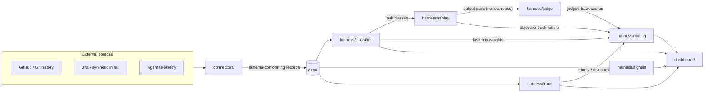

# Agent Measurement Harness

An independent observability and evaluation layer for coding-agent traffic (Cursor, Claude Code), built as an Open Project @ UC Berkeley engagement. It answers three questions no vendor dashboard can: **what are agents actually used for**, **is automatic model routing making good calls**, and **what did the spend actually deliver**.

The harness produces four things:

1. **Visibility** — a task taxonomy and the real usage distribution across teams, tools, and models.
2. **Quality-per-tier curves** — per task class, how quality holds as the model tier drops, and whether attaching a skill lets a class run a tier cheaper at held quality.
3. **Value traceability** — the chain from agent session → commit/PR → ticket/initiative → deployment → outcome.
4. **A routing policy the data justifies** — informed by quality, cost, and the priority/risk of the work.

Governing principle: **glass box by default.** Every classification rule, rubric, and routing recommendation is versioned, documented, and logged with rationale (`docs/decisions/`). Reporting is team-level and above — no individual rankings, ever.

## How the pieces fit together

All components communicate **through data, not direct imports across layers**: every record that crosses a component boundary conforms to a JSON Schema in [`schemas/`](schemas/), and is written to / read from [`data/`](data/) as versioned artifacts. That contract is what makes the system auditable and lets any single component be re-run or replaced in isolation.

## Repository map

| Directory | What it is |
|---|---|
| [`docs/`](docs/) | Proposal, methodology, taxonomy, and the glass-box decision log |
| [`schemas/`](schemas/) | The shared contracts: event schema, task classification, eval results |
| [`connectors/`](connectors/) | Ingestion: GitHub, Jira (synthetic), agent telemetry → normalized records |
| [`harness/`](harness/) | The core Python package — classifier, replay, judge, signals, trace, routing |
| [`data/`](data/) | Synthetic traffic, fixtures, calibration sets. **Never real eBay data.** |
| [`dashboard/`](dashboard/) | Next.js reporting UI — the manager-facing decision buckets |
| [`notebooks/`](notebooks/) | Exploratory analysis and curve plots |
| [`tests/`](tests/) | Test suite for the harness and schema validation |

## Status

Scaffold only — structure and contracts are being defined before any code lands. See each directory's README for what belongs there and its inputs/outputs.
