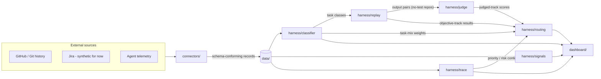

**Purpose:** What Caliper is — the problem, the architecture, the intended product, and the repo map.
**Authoritative for:** The product thesis, how the pieces fit together, and what lives where in this repo.
**Not authoritative for:** Current capability status — that is [`PROGRESS.md`](PROGRESS.md), and only ever `PROGRESS.md`. Design rationale lives in [`docs/decisions/`](docs/decisions/).
**Update when:** The architecture, the intended product, or the repo layout changes — not when capability status changes.
**Last reviewed:** 2026-08-23

# Caliper

An independent observability and evaluation layer for coding-agent traffic — Claude Code, Cursor, and Codex first-class, extensible to other harnesses (ADR-0003). It answers three questions no vendor dashboard can: **what are agents actually used for**, **is automatic model routing making good calls**, and **what did the spend actually deliver**.

The harness produces four things:

1. **Visibility** — a task taxonomy and the real usage distribution across teams, tools, and models.
2. **Quality-per-tier curves** — per task class, how quality holds as the model tier drops, and whether attaching a skill lets a class run a tier cheaper at held quality.
3. **Value traceability** — the chain from agent session → commit/PR → ticket/initiative → deployment → outcome.
4. **A routing policy the data justifies** — informed by quality, cost, and the priority/risk of the work.

Governing principle: **glass box by default.** Every classification rule, rubric, and routing recommendation is versioned, documented, and logged with rationale (`docs/decisions/`). Reporting is team-level and above — no individual rankings, ever.

## Quickstart

```bash
pipx install git+https://github.com/avaneeshjoshi/agent-measurement-harness.git@v0.2.0
caliper setup
open ~/.caliper/reports/first_look.html
```

Setup walks through a trust screen, backfills your local agent logs (Claude
Code, Cursor, Codex — whichever exist), classifies the traffic without
reading its content, and writes a self-contained HTML report. Everything
Caliper produces lives in `~/.caliper/`, local only; nothing leaves your
machine. Remove the scheduled job and see exactly how to delete your data
with `caliper uninstall`; remove the command itself with
`pipx uninstall caliper`.

**Upgrade** (installs are pinned to a tag so two installs a week apart are
the same tool): `pipx install --force git+https://github.com/avaneeshjoshi/agent-measurement-harness.git@v<newer-tag>`.
Installing `@main` instead gives the moving development version.

**Platforms:** macOS is fully supported, including hourly background
collection. Linux runs everything except the scheduler (`caliper schedule`
says so itself; run `caliper extract` manually or from your own timer).
Windows is unsupported and untested.

## The intended product experience

**This section is design narrative, not current capability.** It describes the product Caliper is being built toward, in present tense because that is how the design was written. What actually works today is stated — with evidence — in [`PROGRESS.md`](PROGRESS.md). As of the last review: the Quickstart above is the real install; `setup`, `extract`, `signals`, `classify`, `report`, and `schedule` are the shipped surface (`replay`, `policy`, and `pricing` are development instruments gated behind a source checkout — ADR-0014); the apply step described below writes a decision log and **touches no agent configuration**; verified savings, org detection, and vendor-router verification are unbuilt.

Caliper is designed around one constraint: **engineers do not change how they work.**
No new steps in the coding loop, no prompts to remember, no process to follow. Caliper
reads what the harnesses already log, changes settings the harnesses already respect,
and verifies the results from the same logs it started with.

### 1. Install and first run

```bash
pip install -e .    # today: from a clone — a packaged one-line install is future work
caliper setup
```

First run walks through setup once:

- **Trust screen.** Caliper states exactly what it reads (session metadata, token
  counts, model identity, Git history) and what it never reads (code contents, prompt
  text — dropped at the extraction boundary unless explicitly enabled). Everything
  Caliper does afterward is logged and inspectable.
- **Org detection.** If the account belongs to a managed org (Cursor Teams, Claude
  Code enterprise), Caliper asks whether to follow org policy or run personally.
  Personal mode still measures everything; it only applies changes within the user's
  own scope and packages the rest as evidence to forward.
- **Backfill.** Caliper ingests existing local logs from every harness it finds
  (Claude Code, Cursor, Codex) plus Git history — read-only, incremental, with
  provenance on every record.

### 2. The first look

Backfill ends in a summary of everything the logs can already say: what the agents
were actually used for, which models served it, what it cost, how much of the work
produced code at all, and what happened to that code afterward (survival, rework,
reverts — from Git). This is descriptive and free: no evals have run yet, and no
number is shown that wasn't observed.

### 3. Recommendations, in three honesty tiers

Caliper never presents a claim above its evidence. Recommendations arrive labeled:

1. **Obvious hygiene** — waste with no quality question attached, e.g. the user's own
   revealed preferences made default (they already manually downshift for certain
   work), or lookup-style Q&A sessions paying frontier prices. Apply immediately.
2. **Provisional policy** — routing changes backed by measurements made elsewhere
   (public-repo evals, aggregated anonymized results), labeled as borrowed evidence
   until verified on the user's own traffic.
3. **Measured policy** — changes backed by evals on the user's own task classes.
   Where evidence doesn't exist yet, Caliper says so and offers to run the eval
   rather than guessing.

Consequential-reasoning work (architecture, design, planning) is explicitly
protected: producing no code does not make a session cheap to downgrade, and the
classifier treats reasoning depth as its own axis.

### 4. Apply

```bash
caliper apply
```

One approval, then Caliper writes **native configuration** — per-repo model
defaults, subagent model assignments, vendor auto-router on/off per risk tier,
skills and context files attached where measurement says they make a cheaper tier
viable. Caliper never sits in the request path and runs no router of its own: the
harnesses execute the policy through their own mechanisms. The next prompt simply
behaves differently. Every applied change is recorded with the evidence that
justified it, and reverting is one command.

### 5. Verified savings

Extraction keeps running after apply, so savings are computed from real traffic,
not projections. At apply-time the previous policy is frozen as a baseline; each
subsequent session is priced twice — at the models that actually served it, and at
the models the old policy would have used, with price sheets versioned by effective
date. The difference is the savings number, and it is never shown without the
quality signal beside it: rework and survival rates on every downshifted class, in
the same view. If the cheap tier needs more turns to finish the same work, the
per-completed-task adjustment is shown and the conservative figure is headlined.
If quality degrades, Caliper flags it and offers rollback.

### 6. Staying current

Measurements expire. New models ship, prices change, the router updates, the user's
task mix drifts, the baseline goes stale. Extraction is passive and continuous;
full re-measurement fires on a schedule or when drift is detected — and each
re-verification cycle strengthens the evidence base the next recommendation draws
from.

## How the pieces fit together

The conceptual picture — agent activity on one side, delivery outcomes on the other, with trace as the join between them:

```
ACTIVITY                      OUTCOME
Claude Code ─┐               ┌─ Git/GitHub  (survival, rework, reverts)
Cursor ──────┼─→ sessions    ├─ Jira        (priority, initiative)   [enterprise]
Codex ───────┘        │      └─ Deploy/CI   (shipped or not)         [enterprise]
                      ▼             │
                 TRACE (the join) ◄─┘
                      │
        classifier · replay/judge · signals
                      ▼
              routing policy + reports
```

In repo terms:



All components communicate **through data, not direct imports across layers**: every record that crosses a component boundary conforms to a JSON Schema in [`schemas/`](schemas/), and is written to / read from [`data/`](data/) as versioned artifacts. That contract is what makes the system auditable and lets any single component be re-run or replaced in isolation.

## Repository map

| Directory | What it is |
|---|---|
| [`docs/`](docs/) | Conventions, the glass-box decision log (ADRs), and the web-demo spec |
| [`schemas/`](schemas/) | The shared contracts: sessions, prompt units, task classes, eval results, production signals, trace events, routing policies |
| [`cli/`](cli/) | The `caliper` command — extract, signals, classify, report, replay, policy, setup |
| [`connectors/`](connectors/) | Ingestion: Claude Code, Cursor, and Codex logs plus local git history → normalized records |
| [`harness/`](harness/) | The core Python package. Implemented: classifier, replay, report. Design READMEs only, no code yet: judge, signals*, trace, routing |
| [`data/`](data/) | Frozen per-ADR evidence, calibration sets, fixtures. **Never customer data**; everything Caliper computes about a user lives outside the repo at `~/.caliper/` (ADR-0012) |
| [`dashboard/`](dashboard/) | **Design README only — no app exists yet.** The intended Next.js reporting UI |
| [`notebooks/`](notebooks/) | **Design README only — no notebooks exist yet.** Intended exploratory analysis |
| [`tests/`](tests/) | Test suite for the harness and schema validation |

\* signal *computation* ships today inside `connectors/git_history.py` (`caliper signals`, ADR-0006); `harness/signals/` is the intended home it moves to when the normalize/compute split happens.

## Status

Lives in [`PROGRESS.md`](PROGRESS.md) — the single statement of what works, what is stubbed, and what is blocked, with evidence for every claim. Status is deliberately not duplicated here: a status section in a README goes stale because nothing forces an update; `PROGRESS.md` is updated in the same commit as any capability change (see `CLAUDE.md`).
